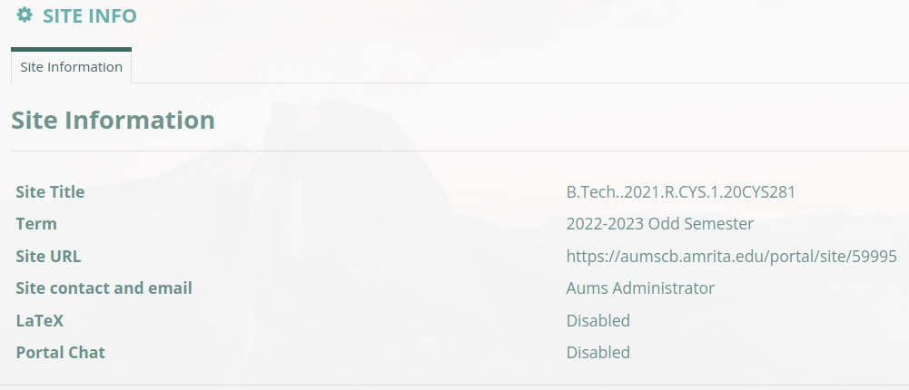

<h1>UI Evaluation of AUMS website</h1>

- The website is intended to be used by college students of Amrita Vishwa Vidhyapeetham Coimbatore campus.

<h3>Login Page</h3>

Strength of the page is the use of clear and concise headings and labels to guide the user through the login process. The page also has a clean and modern design, with a consistent layout and good use of white space.

However, there are a few areas where the page could be improved. The page could benefit from more visual hierarchy, with the use of different font sizes, colors, and other design elements to help guide the user's attention. Additionally, the page could be more mobile-friendly, as it is currently not optimized for smaller screens.

Another area for improvement is the use of error messages. Currently, the page does not provide any feedback if the user enters an incorrect username or password. It would be helpful to have clear and specific error messages to let the user know what went wrong and how to fix it.

Hence to conclude with the Login page it is functional.

<h3>Home Page</h3>

The home page consists of two nav bar one at top and one at the left followed by four sections.

 - The top section consists of links to individual subjects.

    All the sections have a button to copy the link to the current page, a help button which opens the AUMS user guide

    

    and a view fullscreen button depending on the page layout and the section settings.

    <h3>Individual Subject Tabs</h3>

    Each tab has its naming in the format -> {degreeName}.{AdmissionYear}.R.{DeptName}.{SubjectCode}
    Each subject tab has its own drop down with the options shown in image.
    
    The overall layout of all the subject tabs remain the same. 

    <h5>Home Page</h5>
    The home page of indivudual subject tabs is similar to the main home page with four sections having the main subjects tab with the currently selected subject tabs color darker than the rest.

    - A class information section 
    - Recent Announcements section
    - A calendat section
      - The calendar section can be used to view upcoming tests and also jump to them.

    <h5>Syllabus</h5>

    Can be used to share the subject syllabus but is mostly an unused feature since it is easier for faculties to share the syllabus by other means.

    <h5>Lessons</h5>

    May be used to upload the notes but again is mostly an unused feature since the resources section is more than sufficient for these purposes.

    <h5>Calendar</h5>

    Opens a calendar with options to select different views like week, year or month. Contains all the events and quizes that have been planned or have happened particular to the respective subject.

    <h5>Announcements</h5>

    By default opens the announcements made in the subject in the past 365 days.
    The user has the option to view that are either available to All, public or By group.  

    <h5>Resources</h5>

    The resources section is the most used section in the aums website in terms of content volume. All the subject faculties upload their resouces over here.

    <h5>Forums</h5>

    This section is supposed to host discussions related to the subject or anything of that matter.
    It has three tabs :
         - Start a New conversation 
         - Display Message Content
         - View a printable version of the current tab

    <h5>Assignments</h5>

    Section where the faculties specify assignments along with their deadlines.
    The section shows assignments in a table sorted by the date they were created, it shows Status of the assignment whether it has been submitted, started or Not Started, Due Date and Open Date.

    The assignment titles are clickable which then takes you into the assignment details with further details including:
    - Title
    - Student
    - Submitted Date
    - Grade Scale
    - Instructions
    - Additional Resources
    - Submittes Attachments
    - Back to list button 

    <h5>Tests & Quizes</h5>

    Active test and quizes can be accessed from here. Submitted test and their marks can be viewed once the results are published by the faculty.

    <h5>Wiki</h5>

    This page contains details related to page permissions by role concerning the Instructor, student and Teaching Assistant additional page permissions and further details as follows:

    

    <h5>Site Info</h5>

    

    <h5>Polls</h5>

    Used to conduct polls for questions involving opinion of the students.

    <h5>Messages</h5>

    A message system with recieve, send, deleted and draft options.
    

<h3>Nav Bar</h3>

To start with there are two nav bars in the aums website.

One that sits on top of the site with AUMS logo, User welcome message, home button, a button to view all sites, notification alert button, a location button and a drop down menu with options to change passord, about us section and log out button.

Another which floats on the left side of the page with 7 Main menus and each consisting further submenus. The page also has options to select favorite submenus for faster access.

<h4>Registration Page</h5>

Has three submenus:

<h5>Track Registration Status</h5>

Shows registration status about the courses applied.

<h5></h5>
